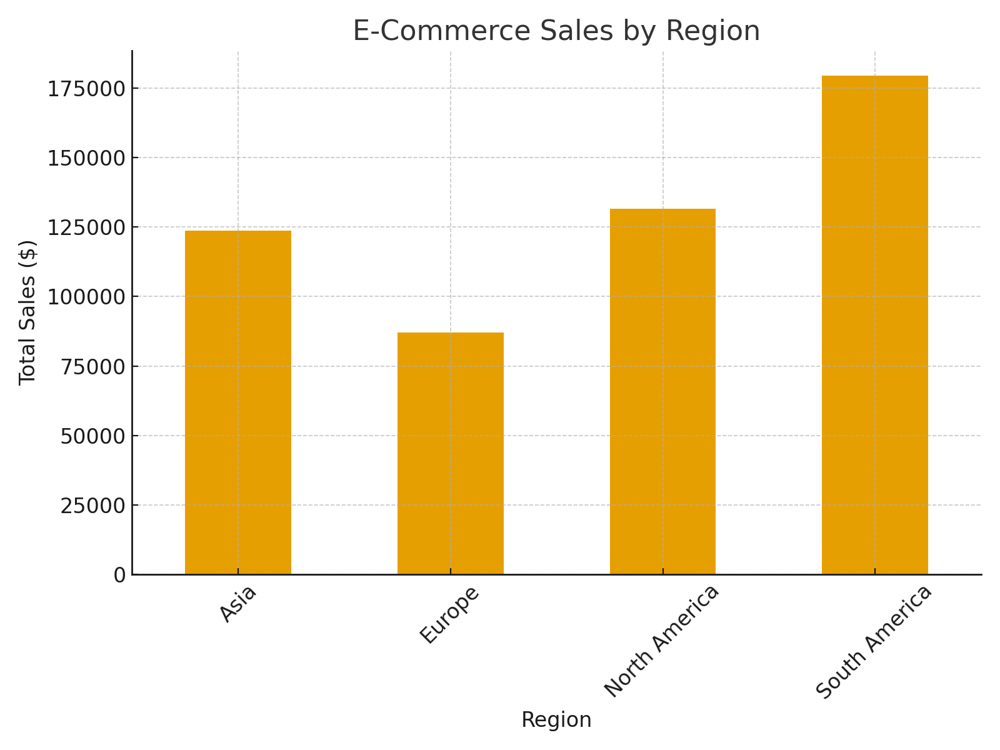

# 🌍 Global E-Commerce Sales Pipeline

## 📌 Project Overview
This project demonstrates an **end-to-end data engineering solution** for an e-commerce company.  
It includes **data ingestion, transformation, storage, and visualization** using Azure cloud services.

## ⚙️ Technologies Used
- Azure Data Factory (ADF) → Orchestrating ETL pipelines  
- Azure Data Lake Storage Gen2 → Storing raw and curated data  
- Azure Synapse Analytics → Data warehouse and reporting layer  
- Databricks (PySpark) → Data transformations at scale  
- Power BI → Interactive dashboards & KPIs  

## 🚀 Workflow
1. **Data Ingestion**  
   - Raw sales data ingested into **Azure Data Lake** via **ADF pipelines**.  

2. **Data Transformation**  
   - PySpark used in Databricks for cleaning and enrichment.  
   - SQL transformations applied in Synapse for fact/dimension modeling.  

3. **Data Storage**  
   - Data stored in a **Star Schema** in Synapse Analytics.  

4. **Visualization**  
   - Power BI dashboards showing sales KPIs by region, trends, and customer insights.  

## 📂 Code
All implementation files are in the `code/` folder:  
- `etl_pipeline.sql` → SQL scripts for staging and fact table transformations  
- `data_transformation_pyspark.ipynb` → PySpark transformations  
- `adf_pipeline.json` → Sample ADF copy pipeline configuration  

## 📊 Dashboard Preview

## ✅ Skills Demonstrated
- Cloud-based ETL pipeline design  
- Incremental loads & performance optimization  
- Data warehouse modeling (Star schema)  
- Building Power BI dashboards with KPIs
